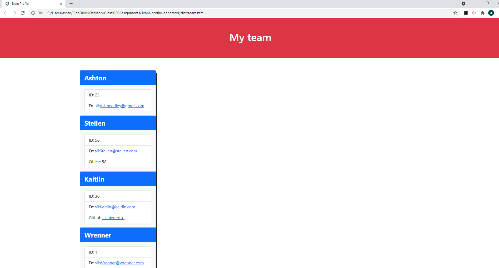

# Team Profile Generator

  
[](https://opensource.org/licenses/none)
  
## Description
It's used to create a website to display your team
  
## Table of Contents
- [Installation](#installation)
- [Usage](#usage)
- [Links](#links)
- [Test](#test)
- [License](#license)
- [Questions](#questions)
  
## Installation
```md
you will need to run an npm install
```
  
## Usage
```md
 After install run index.js and follow Questions to create page
```
  
## Links

Demo = https://drive.google.com/file/d/19EXe0nWHHZ3iONDrYCKece3YBzkKNGph/view?usp=sharing

NPM Test = https://drive.google.com/file/d/101_NpsxeTqNfSnNMeuIpJzCTFuTnq1mP/view?usp=sharing

Webpage Demo = https://drive.google.com/file/d/1gns0istHWedWqA17NMAqpIjzmQQsgVst/view?usp=sharing

## Screenshot


## Reporting
```md
through Github and Email
```
## License
[](https://opensource.org/licenses/none)
  
## Questions 
Add an issue through GitHub:
 https://github.com/undefined
  
Or using email:
 ashheadley@gmail.com

